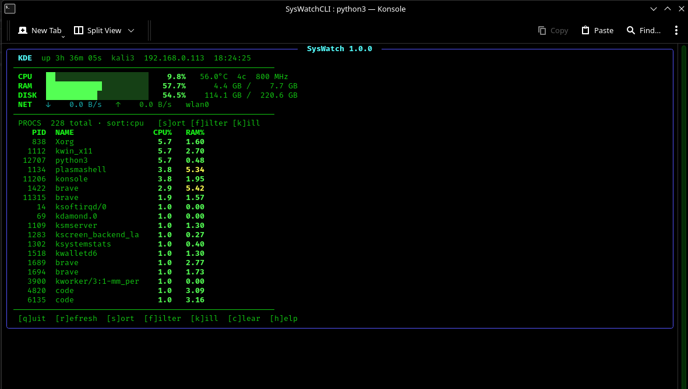

# SysWatch 🖥️
> Lightweight real-time Linux terminal monitor — minimal, fast, clean.


## Preview




## Features
| | |
|---|---|
| CPU | usage %, per-core, frequency, temperature |
| RAM | used / total, swap |
| Disk | root partition usage + read/write speed |
| Network | upload / download speed, active interface |
| Processes | PID, name, CPU%, RAM% — sort, filter, kill |
| Alerts | CPU / RAM / Disk / Net threshold warnings |
| Logging | plain rotating `.log` file |

## Install
```bash
cd SysWatchCLI
python3 -m venv .venv
source .venv/bin/activate
pip install -r requirements.txt
python main.py
```

## Usage
```bash
python main.py                # default 1s refresh
python main.py --refresh 2   # 2-second refresh
python main.py --version
```

## Keys
| Key | Action |
|-----|--------|
| `q` | Quit |
| `r` | Force refresh |
| `s` | Cycle sort (CPU→RAM→PID→Name) |
| `f` | Filter processes by name |
| `k` | Kill process by PID |
| `c` | Clear alerts |
| `h` | Help screen |

## Structure
```
SysWatchCLI/
├── main.py
├── requirements.txt
├── README.md
├── logs/                 ← auto-created
└── syswatch/
    ├── settings.py
    ├── monitor/          cpu · memory · disk · network · process · system
    ├── ui/               dashboard
    └── utils/            helpers · alerts · logger
```

## Stack
`Python 3` · `rich` · `psutil` · `readchar` · `requests`

---
*Built for Kali Linux / Ubuntu — faisalakhtar6180.*
